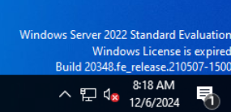
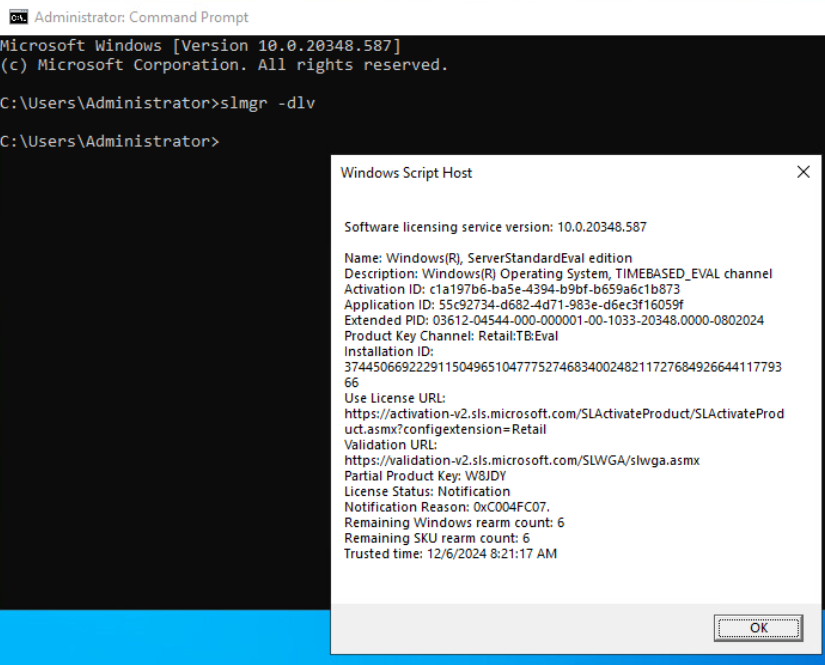
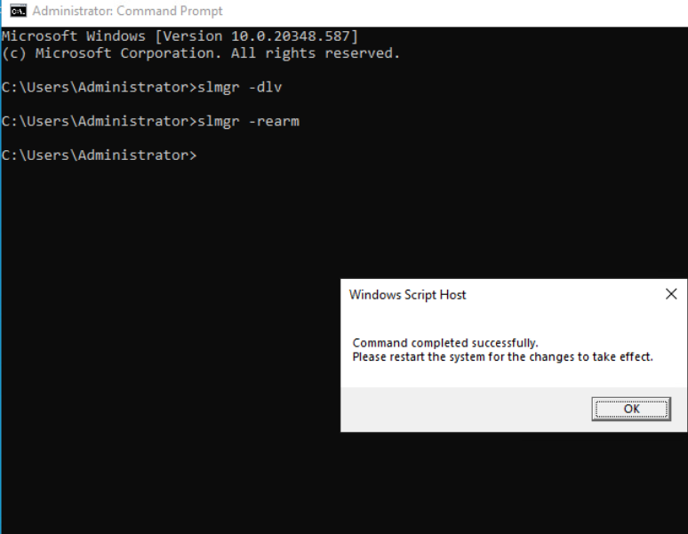
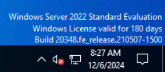
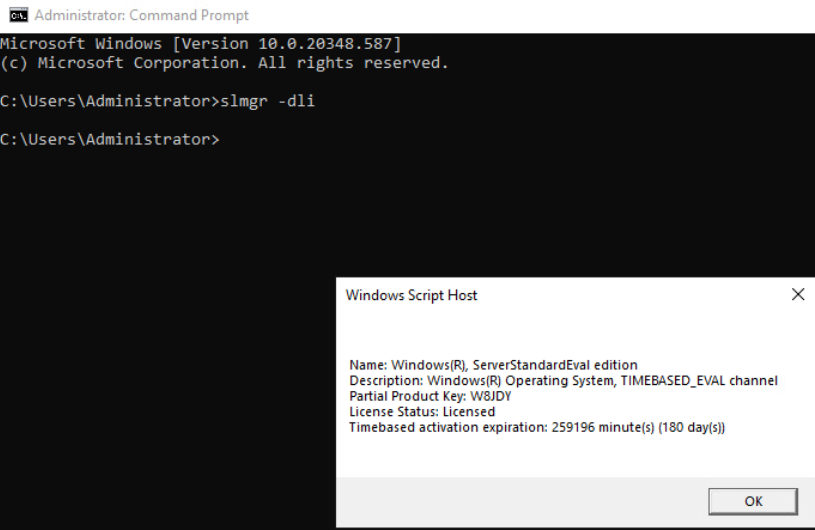

# Extend Windows Evaluation License

### Author: Joe Smith

### Date: 2024-12-06

### Description: This describes how you can extend the life of your evaluation license on your windows servers easy for continued learning for almost 2.5 YEARS!

--- 

As you can see this windows 2022 license is expired so we need to renew it

launch the command prompt as an Administrator and run the following command:

    "slmgr -dlv"

This command shows how many rearms (extensions) you have left for this server

Click OK

run the next command to rearm:

    "slmgr -rearm"

this will actually rearm the server and then you will need to reboot the server and the rearm will be configured

After reboot you should see the new valid message for the server

if you want to you can also run the command prompt as admin and run the following command:

    "slmgr -dli"

